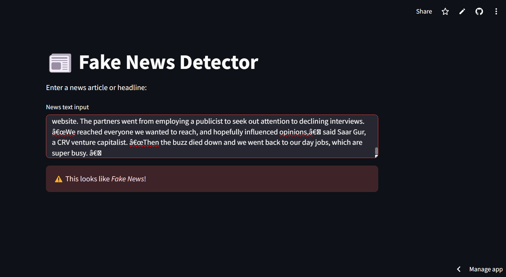

# 📰 Fake News Detector using Machine Learning

A simple web app that uses Natural Language Processing (NLP) and a Machine Learning model to detect whether a news headline or article is **real or fake**.

---

## 🚀 Live Demo

👉 [Click here to try it out!](https://fake-news-detector-8bx6vtg3vonrgaxatqs93j.streamlit.app/)

---

## 📸 Screenshots

### 🔍 Main Interface

### 📥 Input & Output

---

## 🧠 How It Works

- **Data**: Trained on a dataset of real and fake news headlines/articles
- **Preprocessing**:
  - Removed stopwords using `nltk`
  - Vectorized text using `TfidfVectorizer`
- **Model**: Trained a `LogisticRegression` classifier using `scikit-learn`
- **App**: Built with `Streamlit` for interactive input and prediction

---

## 🛠 Tech Stack

- Python
- Streamlit
- scikit-learn
- Pandas
- NLTK
- Joblib

---

## 📦 Folder Structure

